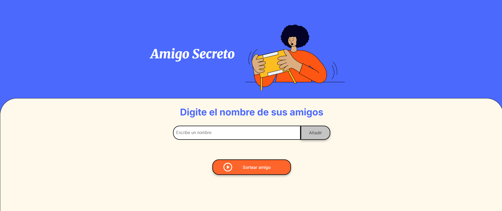

# Challenge Amigo Secreto

Esta aplicación web permite organizar un sorteo de "Amigo Secreto" de manera sencilla. Los usuarios pueden agregar nombres de amigos, visualizar la lista y realizar el sorteo para descubrir quién será su amigo secreto.

## Características

- Agregar nombres de amigos a una lista.
- Visualizar la lista de participantes.
- Sortear aleatoriamente un amigo secreto.
- Validaciones para evitar campos vacíos y asegurar al menos dos participantes.

## Instalación

1. **Clona el repositorio:**
   ```bash
   git clone <URL-del-repositorio>
   ```
2. **Accede a la carpeta del proyecto:**
   ```bash
   cd challenge-amigo-secreto_esp-main
   ```

## Dependencias

Este proyecto es una aplicación web simple que solo utiliza HTML, CSS y JavaScript puro.  
No requiere dependencias externas ni instalación de paquetes.

## Cómo ejecutar el proyecto

1. Abre la carpeta del proyecto.
2. Haz doble clic en el archivo `index.html` para abrirlo en tu navegador preferido.

## Vista previa


## Posibles problemas y soluciones

- **No se agregan nombres:**  
  Verifica que el campo de entrada no esté vacío antes de añadir un nombre.
- **No se realiza el sorteo:**  
  Debes agregar al menos dos amigos para poder sortear.
- **No se visualiza la lista:**  
  Asegúrate de que el archivo `app.js` esté correctamente vinculado en el `index.html`.

## Autor

Desarrollado por Yeifry Leandro Vargas Rivera para el desafio "Practicando Lógica de Programación: Challenge Amigo secreto".

---